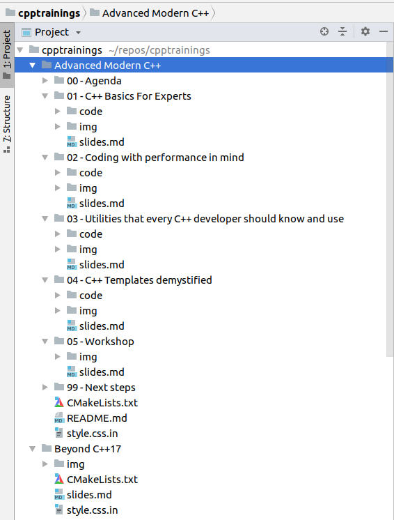

class: title-slide

# How to create slides about CMake with CMake?

## `https://github.com/train-it-eu/remark-cmake`

Mateusz Pusz  
September 25, 2018

---

# CMake? Are you crazy? Why?

.left-column[
- Brings _benefits for large slide decks_
- Slides generation and C++ sample code compilation in _one CMake project_
- Slides _content is orthogonal to presentation layout and style_
  - easy to switch different styles for the same content 
- _Easy reuse_ of slides and whole chapters
- _Handouts_ generation engine
- Easier to write Markdown in `*.md` file (instead of `*.html`)
]

.right-column[
.right[]
]

---

class: small-code

# Remark.js example

```markdown
class: title-slide

# How to create slides about CMake with CMake?

## `https://github.com/mpusz/remark-cmake`

Mateusz Pusz  
September 25, 2018

---

# CMake? Are you crazy? Why?

.left-column[
- Brings _benefits for large slide decks_
- Slides generation and C++ sample code compilation in _one CMake project_
- Slides _content is orthogonal to presentation layout and style_
  - easy to switch different styles for the same content 
- _Easy reuse_ of slides and whole chapters
- _Handouts_ generation engine
- Easier to write Markdown in `*.md` file (instead of `*.html`)
]

.right-column[
.right[]
]
```

---

# What to do?

1. Download `remark.cmake` script from **https://github.com/train-it-eu/remark-cmake** 
2. Define your favorite presentation style and layout
3. If needed fix or add custom language highlighting
4. Prepare presentation content as a Markdown file
5. Aggregate all above in one CMake project 

---

# CMake project with presentations

```cmake
cmake_minimum_required(VERSION 3.3)
project(remark-cmake)

# path to custom cmake modules
list(APPEND CMAKE_MODULE_PATH "${CMAKE_CURRENT_SOURCE_DIR}/cmake")
*include(remark)

# engine definition
add_subdirectory(remark.js)

# presentation definitions
add_subdirectory("API Reference")
add_subdirectory("Example")
```

- Just copy `remark.cmake` to your `./cmake` subdirectory and include it in a project
- More than one presentation possible in one CMake project

---

# Example presentation definition

```cmake
add_remark_slides(example_presentation ALL
    NAME "Slides_about_CMake_with_CMake"
    TITLE "How to create slides about CMake with CMake?"
    STYLE remark-style-default
    STYLE_TEMPLATE style.css.in
    MARKDOWN_SLIDES slides.md
    LANGUAGES
        remark-language-cmake
    RESOURCES
        img/questions.jpg
        img/train-it.png
        img/warning.png
)
```

---

# Engine definition

```cmake
add_remark_engine(default_engine
    ENGINE scripts/remark-latest.min.js
    HTML_TEMPLATE template.html.in
    RESOURCES
        favicon.ico
        scripts/jquery.min.js
        scripts/laser_ptr.js
)
```

---

# Styles definition

```cmake
add_remark_style(remark-style-base
    DEPENDS default_engine
    SOURCES
        css/base.css
)
```

- Hierarchical approach

```cmake
add_remark_style(remark-style-default
    DEPENDS remark-style-base
    SOURCES
        css/default.css
        css/default_colors.css
)
```

---

# Custom highlighting

```cmake
add_remark_language(remark-language-cmake
    SOURCES
        scripts/cmake.language.js
)
```

---

class: small-code

# Big presentations can be divided into chapters

.left-column[
```cmake
set(TRAINING_NAME "api_reference")

add_remark_chapter(${TRAINING_NAME}_chapter_title
    BASE_DIR "1 - Title"
    MARKDOWN_SLIDES
        slides.md
)

add_remark_chapter(${TRAINING_NAME}_chapter_api
    BASE_DIR "2 - API Reference"
    MARKDOWN_SLIDES
        slides.md
)

add_remark_chapter(${TRAINING_NAME}_chapter_end
    BASE_DIR "3 - End"
    MARKDOWN_SLIDES
        slides.md
    RESOURCES
        img/warning.png
)
```
]

--

.right-column[
```cmake
add_remark_slides(${TRAINING_NAME} ALL HANDOUTS
    NAME ${TRAINING_NAME}
    TITLE "cmake.remark API Reference"
    STYLE remark-style-default
    STYLE_TEMPLATE style.css.in
    LANGUAGES
        remark-language-cmake
*   CHAPTERS
*       ${TRAINING_NAME}_chapter_title
*       ${TRAINING_NAME}_chapter_api
*       ${TRAINING_NAME}_chapter_end
)
```
]


---

class: small-code

# Handouts generation

.left-column[
## Original

```markdown
# Slide with animation

This part

--

and this part

--

will not generate separate slides in handouts

---

exclude: handouts

# Slide that should not be included in handouts

This slide wil not be included in handouts

---

# Next slide
```
]

.right-column[
## Handouts

```markdown
# Slide with animation

This part

and this part

will not generate separate slides in handouts

---

# Next slide
```

- Handouts generator removes
  - all `--` animation breaks
  - whole slides with `exclude: handouts`
- Useful for PDF files generation
]

---

# More info?

.info[
**https://github.com/train-it-eu/remark-cmake**
]

- **`remark.cmake`** script
- Source of _that presentation_
- Presentation with _API Reference_
- Example _style and layout_
- Simple JavaScript scripts (i.e. _laser_)
- Custom _highlighting for CMake_ language

---

class: section-title-slide
background-image: url(img/questions.jpg)
<!-- Image source: https://pixabay.com/en/idea-question-light-bulb-1296140/ -->

---

class: section-title-slide
background-image: url(img/warning.png)
<!-- https://openclipart.org/detail/18736/programming-addictive-sign -->
